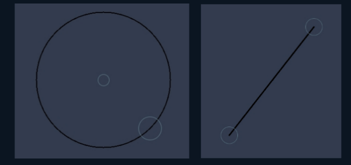

# DrawingView
simple drawing view with ability to draw shapes and customize the view
change between Eraser/Pen Mode
```
DrawingV.setEraserMode(false);
```
Change Drawing Color 
```
DrawingV.setColor(Color.BLACK);
```
undo/redo/clear
```
DrawingV.undo();//undo last draw
DrawingV.redo();
DrawingV.clear();//clear the draw
```
Check ability To Undo/Redo
```
if(CanUndo()){
//do something if there is ability to Undo
};
if(CanRedo()){
//do something if there is ability to Redo
};
```
set/get pen size 
```
DrawingV.setPenSize(getPenSize()+1);//set pen size
```
set Drawing Type 
```
DrawingV.setDrawType(DrawingView.TYPES.SQUARE);
//Types:- SQUARE/PEN/LINE/CIRCLE/TRIANGLE1/TRIANGLE2
```
# helpers 
```
DrawingV.ShowHelper(true);//To show Thae Helper
```

# ScreenShot
</img>
